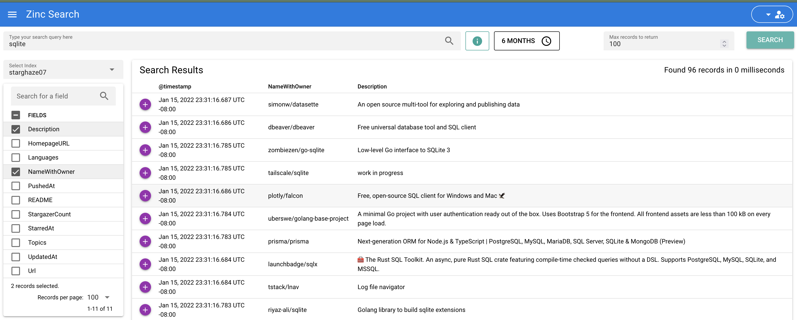

# stargaze

Save information about your GitHub starred repos into Google Sheets, Zinc, and SQLite!

Thanks to https://github.com/yks0000/starred-repo-toc for the inspiration!

GraphQL and Google Sheets auth notes at [./dev_notes.md](./dev_notes.md)

## Install

- Homebrew: `brew install bbkane/tap/starghaze`
- Download Mac/Linux/Windows executable: [GitHub releases](https://github.com/bbkane/starghaze/releases)
- Go: `go install github.com/bbkane/starghaze@latest`
- Build with [goreleaser](https://goreleaser.com/) after cloning: `goreleaser --snapshot --skip-publish --rm-dist`

## Download GitHub Stars

### Download Star Info

```bash
GITHUB_TOKEN=my_github_token starghaze download \
    --include-readmes true \
    --output stars.jsonl
```

## Google Sheets

### Format Downloaded Stars as CSV

````bash
starghaze format \
    --format csv \
    --include-readmes false \
    --output stars.csv
````

### Upload CSV to Google Sheets

```bash
GOOGLE_APPLICATION_CREDENTIALS=/path/to/keys.json starghaze gsheets upload \
    --csv-path stars.csv \
    --sheet-id 0 \
    --spreadsheet-id 15AXUtql31P62zxvEnqxNnb8ZcCWnBUYpROAsrtAhOV0 \
    --timeout 30s
```

### Analyze Away!

**Click here to see [My GitHub Stars Google Sheet](https://docs.google.com/spreadsheets/d/15AXUtql31P62zxvEnqxNnb8ZcCWnBUYpROAsrtAhOV0/edit?usp=sharing)**


## Save Stars to [Zinc](https://github.com/prabhatsharma/zinc)

### Format Downloaded Stars as Zinc

```bash
starghaze format \
    --include-readmes true \
    --format zinc \
    --output stars.zinc \
    --zinc-index-name starghaze
```

### Upload to Zinc

Using default settings - See [Zinc repo](https://github.com/prabhatsharma/zinc) for more details.

```bash
curl http://localhost:4080/api/_bulk -i -u admin:Complexpass#123 --data-binary "@stars.zinc"
```

### Search!



## SQLite

### Format Downloaded Stars to SQLite (with [full text](https://www.sqlite.org/fts5.html) search)

```bash
starghaze format \
    --format sqlite \
    --include-readmes true \
    --sqlite-dsn starghaze.db
```

### Query!

For example, find the top 10 languages (as measured by number of repos) in the starred collection.

```bash
$ sqlite3 starghaze.db '
SELECT
    l.Name ,
    COUNT(lr.Language_id) as Repo_Count
FROM
    Language_Repo lr JOIN Language l ON lr.Language_id = l.id
GROUP BY Language_id
ORDER BY Repo_Count DESC
LIMIT 10
'
-- Loading resources from /Users/bbkane/.sqliterc
┌────────────┬────────────┐
│    Name    │ Repo_Count │
├────────────┼────────────┤
│ Shell      │ 939        │
│ JavaScript │ 617        │
│ HTML       │ 598        │
│ Python     │ 540        │
│ Makefile   │ 519        │
│ CSS        │ 432        │
│ Dockerfile │ 403        │
│ Go         │ 367        │
│ C          │ 305        │
│ C++        │ 230        │
└────────────┴────────────┘
```
