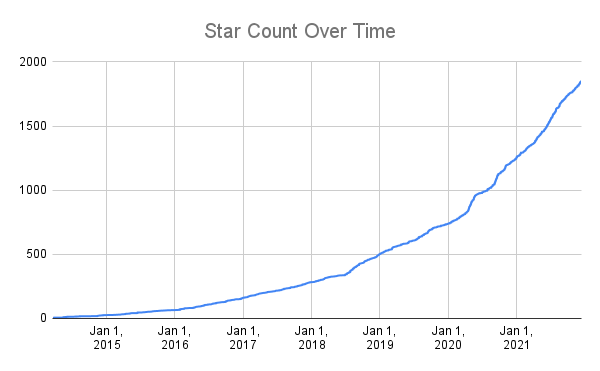

# stargaze

Save information about starred GitHub repos to a CSV or JSON file, and upload CSVs to Google Sheets!

**Click here to see [My GitHub Stars Google Sheet](https://docs.google.com/spreadsheets/d/15AXUtql31P62zxvEnqxNnb8ZcCWnBUYpROAsrtAhOV0/edit?usp=sharing)**



Thanks to https://github.com/yks0000/starred-repo-toc for the inspiration!

GraphQL and Google Sheets auth notes at [./dev_notes.md](./dev_notes.md)

## Example

Note: most of these options have sane defaults already set. Use `--help` to see what the default is.

```bash
GITHUB_TOKEN=my_token_value starghaze github stats \
    --date-format '%b %d, %Y' \
    --format csv \
    --max-pages 3 \
    --output stars.csv \
    --page-size 100 \
    --timeout 10m
```

```bash
GOOGLE_APPLICATION_CREDENTIALS=/path/to/keys.json starghaze gsheets upload \
    --csv-path stars.csv \
    --sheet-id 0 \
    --spreadsheet-id 15AXUtql31P62zxvEnqxNnb8ZcCWnBUYpROAsrtAhOV0 \
    --timeout 30s
```

## Install

- Homebrew: `brew install bbkane/tap/starghaze`
- Download Mac/Linux/Windows executable: [GitHub releases](https://github.com/bbkane/starghaze/releases)
- Go: `go install github.com/bbkane/starghaze@latest`
- Build with [goreleaser](https://goreleaser.com/) after cloning: `goreleaser --snapshot --skip-publish --rm-dist`

## TODO

- open file to append?
- comment out unused fields, reduce maxLanguages
- make scanner size configurable
- add option to include-readme when formattign too
