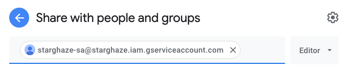

# Learning GraphQL

Instead of making a couple thousand REST calls, I can make a GraphQL call:

https://docs.github.com/en/graphql

https://docs.github.com/en/graphql/overview/explorer

https://github.blog/2016-09-14-the-github-graphql-api/ has a starred REPO example

```
labels(first:2) {
  edges {
    node {
      description
      createdAt
      id
      name
    }
  }
}
```

This appears to refer to issue labels - I don't think I care about it

I don't think I need whatever `object` is :)

So far I have:


```
{
  viewer { login
    starredRepositories(first: 2) {
      totalCount
      edges {
        cursor
        node {
          name
          stargazers {
            totalCount
          }
          description
          homepageUrl
          id
          name
          nameWithOwner
          pushedAt
          repositoryTopics(first: 10) {
            nodes {
              url
              topic {
                name
              }
            }
          }
          updatedAt
          url
        }
      }
    }
  }
  rateLimit {
    limit
    cost
    remaining
    resetAt
  }
}
```

Let's read more about pagination

https://www.apollographql.com/blog/graphql/explaining-graphql-connections/ - explains how to page (first: 2, after: *id*)

https://javascript.plainenglish.io/graphql-pagination-using-edges-vs-nodes-in-connections-f2ddb8edffa0 - it looks like `nodes` is a shorthand in case you don't need information from the edge relationship - it also looks like it doesn't support pagination? yes - because that's a property of the edge, not the nodes


```
{
  viewer {
    login
    starredRepositories(first: 2, orderBy: {field:STARRED_AT, direction:DESC}, after:"Y3Vyc29yOnYyOpK5MjAyMS0xMi0wNFQyMToxOTo1Ny0wODowMM4STnrd") {
      totalCount
      edges {
        cursor
        node {
          nameWithOwner
        }
      }
    }
  }
}
```

So you include a cursor, then each note gets one. Grab the last one and use the after field in the next query.

On to https://github.com/shurcooL/githubv4 to make this work in Go - TODO: port to Elm? I can cache responses client side

https://docs.github.com/en/graphql/reference/queries

https://docs.github.com/en/graphql/guides/forming-calls-with-graphql

https://graphql.org/learn/pagination/ explains the edges and cursor pagination really well. - can also get pageInfo.hasNextPage

It looks like github's pageInfo does include endCursor to get to the next page - let's try it

```
{
  viewer {
    starredRepositories(first: 2, orderBy: {field:STARRED_AT, direction:DESC}, after:"Y3Vyc29yOnYyOpK5MjAyMS0xMi0wNFQxMjo1ODo1OC0wODowMM4STfEt") {
      nodes {
        nameWithOwner
      }
      pageInfo {
        endCursor
        hasNextPage
      }
    }
  }
}
```

And that works

The one I want is:

```graphql
{
  viewer {
    starredRepositories(first: 2, orderBy: {field: STARRED_AT, direction: ASC}) {
      edges {
        starredAt
        node {
          name
          description
          homepageUrl
          nameWithOwner
          pushedAt
          repositoryTopics(first: 10) {
            nodes {
              url
              topic {
                name
              }
            }
          }
          stargazerCount
          updatedAt
          url
        }
      }
      pageInfo {
        hasNextPage
        endCursor
      }
    }
  }
}

```

breaking it up into fragments...

# Google Sheets Authentication/Authorization

Making a project and a service account so my app has permission to upload to a Google Sheet

Open CloudTerminal from the button on the top right of the  [console](https://console.cloud.google.com/home/dashboard) or [directly](https://shell.cloud.google.com/)

Use “gcloud config set project [PROJECT_ID]” to change to a different project.

## [Create a Project](https://cloud.google.com/sdk/gcloud/reference/projects/create)

```
$ gcloud projects create starghaze
Create in progress for [https://cloudresourcemanager.googleapis.com/v1/projects/starghaze].
Waiting for [operations/cp.7358087792659517101] to finish...done.
Enabling service [cloudapis.googleapis.com] on project [starghaze]...
Operation "operations/acf.p2-824192962629-dbb00832-15b2-480b-91dc-cf3ceb5220e3" finished successfully.
```

## Change to `starghaze`

```
$ gcloud config set project starghaze
Updated property [core/project].
```

## [Enable API Access for `starghaze`](https://cloud.google.com/sdk/gcloud/reference/services/enable)

```
$ gcloud services enable sheets.googleapis.com
Operation "operations/acf.p2-824192962629-37a88c62-c546-46b5-9087-9fa97a68c58c" finished successfully.
```

## [Create a Service Account](https://cloud.google.com/docs/authentication/production#command-line)

```
$ gcloud iam service-accounts create starghaze-sa
Created service account [starghaze-sa].
```

```
$ gcloud projects add-iam-policy-binding starghaze --member="serviceAccount:starghaze-sa@starghaze.iam.gserviceaccount.com" --role="roles/owner"
Updated IAM policy for project [starghaze].
bindings:
- members:
  - serviceAccount:starghaze-sa@starghaze.iam.gserviceaccount.com
  - user:<my email>
  role: roles/owner
etag: BwXSy6ZN_FM=
version: 1
```

```
$ gcloud iam service-accounts keys create starghaze-sa-keys.json --iam-account=starghaze-sa@starghaze.iam.gserviceaccount.com
created key [6bd47f6450cc29401df0a5e4632f32e68dca14d3] of type [json] as [starghaze-sa-keys.json] for [starghaze-sa@starghaze.iam.gserviceaccount.com]
```

## [Download Keys](https://cloud.google.com/shell/docs/uploading-and-downloading-files)

```
$ cloudshell download starghaze-sa-keys.json
```

## Create and Share [a Google Sheet](https://docs.google.com/spreadsheets/d/15AXUtql31P62zxvEnqxNnb8ZcCWnBUYpROAsrtAhOV0/edit#gid=0) with `stargaze-sa`



---

```
$ GOOGLE_APPLICATION_CREDENTIALS=starghaze-sa-keys.json go run . gsheets upload
No data found.
```
